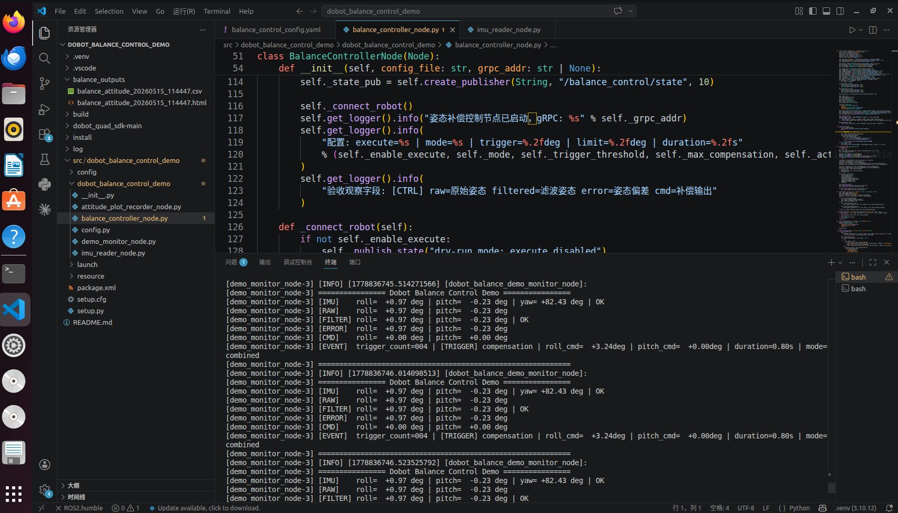
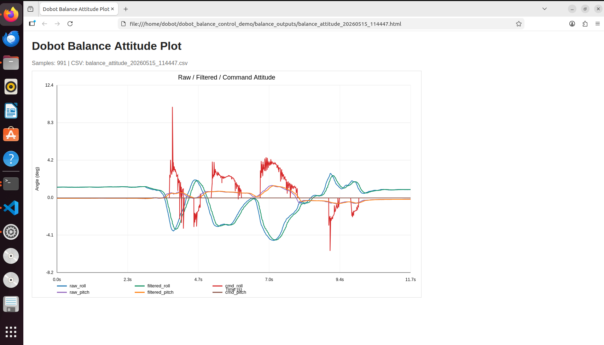

# Dobot IMU Attitude Balance Compensation Project

This project is a ROS 2 Python project that demonstrates how the Dobot quadruped robot performs roll/pitch balance compensation based on low-level IMU attitude data.

The system subscribes read-only to the robot low-level state topic `rt/lower/state` through DDS, extracts the IMU quaternion, angular velocity, acceleration, and RPY attitude, and then performs attitude publishing, filtering, offset calculation, PID/P control, output limiting, and cooldown control in ROS 2. When the attitude deviation exceeds the threshold, the Dobot high-level gRPC SDK is used to call `balance_roll`, `balance_pitch`, or `dynamic_pose` to execute attitude compensation actions.

This Demo is positioned as “low-level read-only + high-level action compensation”. It does not directly publish `LowerCmd`, does not perform motor-level closed-loop control (improper direct motor control can **cause serious safety accidents**), and does not call `kill_robot`. Robot standing, joint protection, state switching, and action safety boundaries are handled by the robot controller and the high-level SDK.

## Project Features:

The project currently includes the following core capabilities:

| Functional Module     | Implementation File                                   | Main Responsibility                                                     |
| ------------ | ------------------------------------------ | ------------------------------------------------------------ |
| IMU data reading | `imu_reader_node.py`                       | Subscribes to `rt/lower/state` through `dds_middleware_python`, parses IMU data, and publishes ROS 2 attitude topics |
| Attitude compensation control | `balance_controller_node.py`               | Applies moving average and low-pass filtering to roll/pitch, calculates attitude errors and PID output, and triggers high-level SDK attitude actions |
| Terminal monitoring panel | `demo_monitor_node.py`                     | Aggregates and displays IMU, raw attitude, filtered attitude, errors, commands, and trigger events for demonstration scenarios |
| Curve recording export | `attitude_plot_recorder_node.py`           | Optionally records `/balance_control/attitude` and generates CSV and self-contained HTML curves on exit |
| Parameter configuration     | `config.py`, `balance_control_config.yaml` | Loads YAML, parses DDS and CycloneDDS paths, and centrally manages control parameters     |
| One-command startup     | `balance_control.launch.py`                | Starts IMU reading, the controller, the monitoring panel, and optionally the curve recording node      |

## Data Flow

```text
Dobot low-level state DDS: rt/lower/state
        |
        v
imu_reader_node
        |-- /balance_control/imu_raw
        |-- /balance_control/imu_rpy
        |-- /balance_control/imu_status
        v
balance_controller_node
        |-- Moving average + low-pass filtering
        |-- Attitude error calculation
        |-- PID/P output
        |-- Deadband, output limiting, and action cooldown
        |-- High-level SDK: balance_roll / balance_pitch / dynamic_pose
        |
        |-- /balance_control/attitude
        |-- /balance_control/attitude_report
        |-- /balance_control/state
        |
        +------------------------+
        |                        |
        v                        v
demo_monitor_node        attitude_plot_recorder_node
Terminal demo panel       CSV / HTML curve archive
```

## Control Logic

1. `imu_reader_node` receives IMU RPY from DDS and publishes it to `/balance_control/imu_rpy` in radians.
2. `balance_controller_node` converts roll/pitch to degrees, applies a moving average first, and then applies first-order low-pass filtering.
3. The controller calculates the error between the filtered attitude and the target attitude. The default target is `roll=0 deg` and `pitch=0 deg`.
4. PID output is processed with direction signs, maximum compensation angle limits, stabilization deadband, and action cooldown.
5. When the roll or pitch error exceeds `trigger_threshold_deg`, a background thread calls the high-level SDK to execute the compensation action.
6. The node continuously publishes attitude arrays, text reports, and state events for the terminal panel, curve recorder, or `rqt_plot`.

## Safety Boundaries

This project is suitable for demonstrating the closed-loop concept of “IMU attitude perception + high-level action compensation”, but it is not a motor-level controller.

| Item                | Current Strategy                                                     |
| ------------------- | ------------------------------------------------------------ |
| DDS sensor data      | Read-only subscription to IMU state                                      |
| Robot actions          | Trigger attitude actions through the high-level gRPC SDK                               |
| Motor command `LowerCmd` | Not published; joints are not directly controlled                                       |
| `kill_robot`        | Not called                                                       |
| Physical robot debugging            | It is recommended to first set `enable_execute: false` to observe data and control output, then enable action execution |

If joint-level closed-loop control is required, create a separate low-level control project and prepare a safety rope, emergency stop, support frame, off-ground debugging procedure, and strict safety review.

## Directory Structure

```text
dobot_balance_control_demo/
├── README.md
├── assets
├── balance_outputs
├── dobot_quad_sdk-main
└── src/
    └── dobot_balance_control_demo/
        ├── package.xml
        ├── setup.py
        ├── setup.cfg
        ├── config/
        │   └── balance_control_config.yaml
        ├── launch/
        │   └── balance_control.launch.py
        ├── resource/
        │   └── dobot_balance_control_demo
        └── dobot_balance_control_demo/
            ├── __init__.py
            ├── attitude_plot_recorder_node.py
            ├── balance_controller_node.py
            ├── config.py
            ├── demo_monitor_node.py
            └── imu_reader_node.py
```

## Environment Requirements

| Item | Requirement |
| --- | --- |
| Operating system | Ubuntu 22.04 |
| ROS 2 | Humble |
| Python | 3.10 |
| Network | The development machine and quadruped robot are connected through a wired network on the `192.168.5.x` subnet |
| SDK | `dobot_quad_sdk-main` is located in the project root directory |

Default robot address:

```text
192.168.5.2:50051
```

The DDS IMU link requires a wired network connection. When using a virtual machine, it is recommended to set the network interface connected to the quadruped robot to bridged mode.

## Install Dependencies

Install system dependencies:

```bash
sudo apt update
sudo apt install -y python3-venv python3-pip python3-colcon-common-extensions
```

Create and activate a virtual environment:

```bash
cd ~/dobot_balance_control_demo
python3 -m venv .venv
source .venv/bin/activate
python -m pip install --upgrade pip setuptools wheel
```

Install ROS 2 Python build dependencies:

```bash
python -m pip install empy==3.3.4 catkin_pkg lark pyyaml numpy
```

Install the Dobot high-level gRPC SDK:

```bash
cd ~/dobot_balance_control_demo/dobot_quad_sdk-main/high_level/python
python -m pip install -e .
```

Install the DDS middleware and Python dependencies:

```bash
cd ~/dobot_balance_control_demo/dobot_quad_sdk-main/dist
sudo dpkg -i dds-middleware-with-thirdparty*.deb
export CYCLONEDDS_HOME="/usr/local/"
python -m pip install dds_middleware_python-*.whl
python -m pip install cyclonedds pyyaml numpy
```

Verify dependencies:

```bash
python -c "import dobot_quad; print('dobot_quad ok')"
python -c "import dds_middleware_python; print('dds ok')"
```

## Network Configuration

Confirm the name of the wired network interface connected to the quadruped robot:

```bash
ip a
```

If you need to manually set the development machine IP:

```bash
sudo ip addr add 192.168.5.100/24 dev <network_interface_name>
sudo ip link set <network_interface_name> up
```

Edit the CycloneDDS configuration:

```bash
nano ~/dobot_balance_control_demo/dobot_quad_sdk-main/cyclonedds.xml
```

Change the network interface name in the file to the wired network interface connected to the quadruped robot. Set the following before startup:

```bash
export CYCLONEDDS_URI=file:///home/dobot/dobot_balance_control_demo/dobot_quad_sdk-main/cyclonedds.xml
```

If the project path is not `/home/dobot/dobot_balance_control_demo`, replace it with the actual path.

## Configuration Description

Configuration file:

```text
src/dobot_balance_control_demo/config/balance_control_config.yaml
```

Key parameters:

```yaml
robot:
  grpc_addr: "192.168.5.2:50051"
  enter_balance_stand_on_start: true
  enable_execute: true

dds:
  config_file: "dobot_quad_sdk-main/low_level/python/config/dds_config.yaml"
  domain_id: 0
  lower_state_topic: "rt/lower/state"
  publish_period_seconds: 0.02

filter:
  low_pass_alpha: 0.25
  moving_average_window: 5

control:
  target_roll_deg: 0.0
  target_pitch_deg: 0.0
  trigger_threshold_deg: 3.0
  settle_threshold_deg: 1.5
  max_compensation_deg: 10.0
  action_duration_seconds: 0.8
  action_cooldown_seconds: 1.2
  roll_output_sign: -1.0
  pitch_output_sign: -1.0
  kp_roll: 0.8
  ki_roll: 0.0
  kd_roll: 0.08
  kp_pitch: 0.8
  ki_pitch: 0.0
  kd_pitch: 0.08
  integral_limit_deg_s: 8.0
  compensation_mode: "combined"

display:
  monitor_period_seconds: 0.5
  stale_timeout_seconds: 2.0

plot:
  output_dir: "balance_outputs"
  max_samples: 5000
```

Common parameter tuning description:

| Parameter                                                     | Description                                                         |
| -------------------------------------------------------- | ------------------------------------------------------------ |
| `robot.enable_execute`                                   | When set to `false`, only control calculations and logs are published, and robot actions are not called. Suitable for dry runs without a physical robot or safe parameter tuning |
| `robot.enter_balance_stand_on_start`                     | Whether to automatically call the high-level SDK to enter balance standing after the controller starts                |
| `filter.low_pass_alpha`                                  | Low-pass filter coefficient. Smaller values are smoother; larger values respond faster                       |
| `filter.moving_average_window`                           | Moving average window length                                             |
| `control.trigger_threshold_deg`                          | Compensation is triggered only when the attitude deviation exceeds this threshold                                 |
| `control.settle_threshold_deg`                           | Stabilization deadband. When the error is below this value, the output for the corresponding axis is set to zero                       |
| `control.max_compensation_deg`                           | Single compensation angle limit                                             |
| `control.action_cooldown_seconds`                        | Minimum interval between two compensation actions, used to avoid continuously triggering the high-level action interface             |
| `control.roll_output_sign` / `control.pitch_output_sign` | Compensation direction sign. If the physical robot compensates in the opposite direction, adjust this first                   |
| `control.compensation_mode`                              | `combined` uses `dynamic_pose` to compensate roll/pitch simultaneously; `axis` calls `balance_roll` and `balance_pitch` separately |
| `plot.output_dir`                                        | CSV/HTML output directory after curve recording is enabled. Relative paths are based on the current directory where `ros2 launch` is executed |

## Build

```bash
cd ~/dobot_balance_control_demo
source .venv/bin/activate
source /opt/ros/humble/setup.bash
colcon build --base-paths src --packages-select dobot_balance_control_demo
source install/setup.bash
```

Before running in a newly opened terminal each time, it is recommended to source the environments in order:

```bash
cd ~/dobot_balance_control_demo
source .venv/bin/activate
source /opt/ros/humble/setup.bash
source install/setup.bash
```

## Startup

Demo startup:

```bash
cd ~/dobot_balance_control_demo
source .venv/bin/activate
source /opt/ros/humble/setup.bash
source install/setup.bash
export CYCLONEDDS_URI=file:///home/dobot/dobot_balance_control_demo/dobot_quad_sdk-main/cyclonedds.xml
ros2 launch dobot_balance_control_demo balance_control.launch.py
```

Start and record curves:

```bash
ros2 launch dobot_balance_control_demo balance_control.launch.py record_plot:=true
```

Example normal log:



Console field meanings:

| Field | Meaning | Classroom Observation Method |
| --- | --- | --- |
| `[IMU]` | IMU attitude read from DDS, in degrees | `OK` indicates that IMU data is being updated |
| `[RAW]` | Raw roll/pitch received by the control node | It should change quickly when the robot is shaken or lightly pressed |
| `[FILTER]` | Filtered roll/pitch | Smoother than RAW, with slight delay allowed |
| `[ERROR]` | Current attitude deviation from the target attitude | The default target is 0 degrees, so it is usually close to FILTER |
| `[CMD]` | Compensation angle calculated by the controller | Non-zero output may appear when the stabilization threshold is exceeded |
| `[EVENT]` | Recent events and compensation trigger count | `[TRIGGER] compensation` indicates that compensation has been triggered |

## ROS 2 Topics

| Topic | Type | Description |
| --- | --- | --- |
| `/balance_control/imu_raw` | `std_msgs/Float32MultiArray` | `[quat4, gyro3, accel3, rpy3]`, rpy in rad |
| `/balance_control/imu_rpy` | `std_msgs/Float32MultiArray` | `[roll, pitch, yaw]`, in rad |
| `/balance_control/attitude` | `std_msgs/Float32MultiArray` | `[raw_roll, raw_pitch, filtered_roll, filtered_pitch, cmd_roll, cmd_pitch]`, in deg |
| `/balance_control/attitude_report` | `std_msgs/String` | Optional debug topic: single-frame attitude calculation text report |
| `/balance_control/state` | `std_msgs/String` | Control state and action events |
| `/balance_control/imu_status` | `std_msgs/String` | IMU waiting or exception status |

## Curve Recording Output

Enable curve recording:

```bash
ros2 launch dobot_balance_control_demo balance_control.launch.py record_plot:=true
```

After the demo ends, press `Ctrl+C` to exit normally. The program generates the following under `balance_outputs/`:

```text
balance_attitude_YYYYMMDD_HHMMSS.csv
balance_attitude_YYYYMMDD_HHMMSS.html
```

CSV fields:

```text
time_s, raw_roll_deg, raw_pitch_deg, filtered_roll_deg, filtered_pitch_deg, command_roll_deg, command_pitch_deg
```

The HTML file is a self-contained SVG curve file that can be opened directly in a browser and includes:

- `raw_roll` / `raw_pitch`: raw attitude angles
- `filtered_roll` / `filtered_pitch`: filtered attitude angles
- `cmd_roll` / `cmd_pitch`: compensation angles output by the controller

Example curves:



## FAQ

### Cannot Subscribe to IMU Data

Check:

- Whether `CYCLONEDDS_URI` points to a valid `cyclonedds.xml`.
- Whether the network interface name in the CycloneDDS configuration is correct.
- Whether the development machine and quadruped robot are on the `192.168.5.x` wired subnet.
- Whether `CYCLONEDDS_URI` has been set in the startup terminal.

### HTML Curves Are Not Generated

Check:

- Whether the startup command includes `record_plot:=true`.
- Whether the launch has been exited normally by pressing `Ctrl+C`. Curve files are generated on exit.

- Whether startup was performed from the project root directory. The default output directory is:

```text
~/dobot_balance_control_demo/balance_outputs
```
